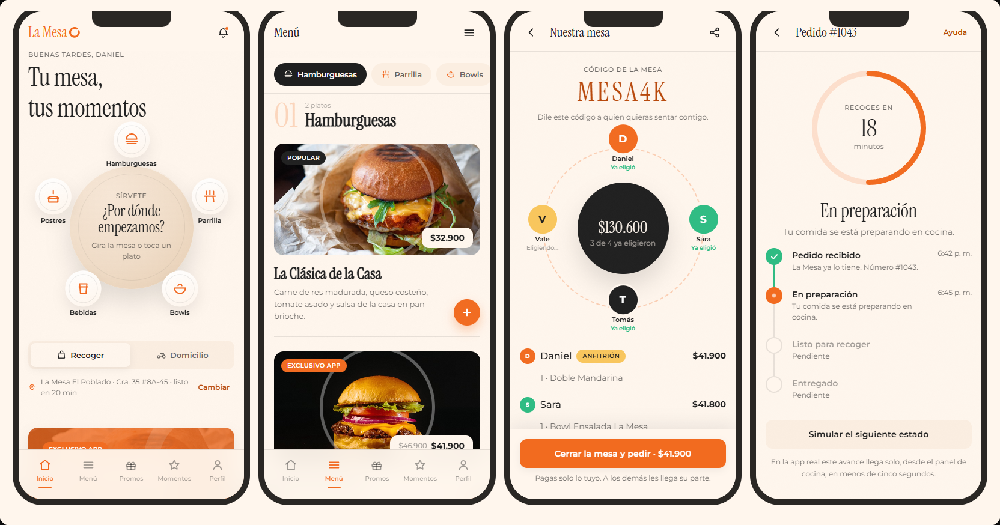
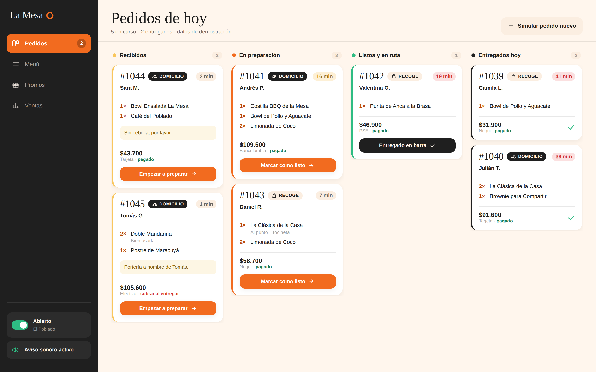
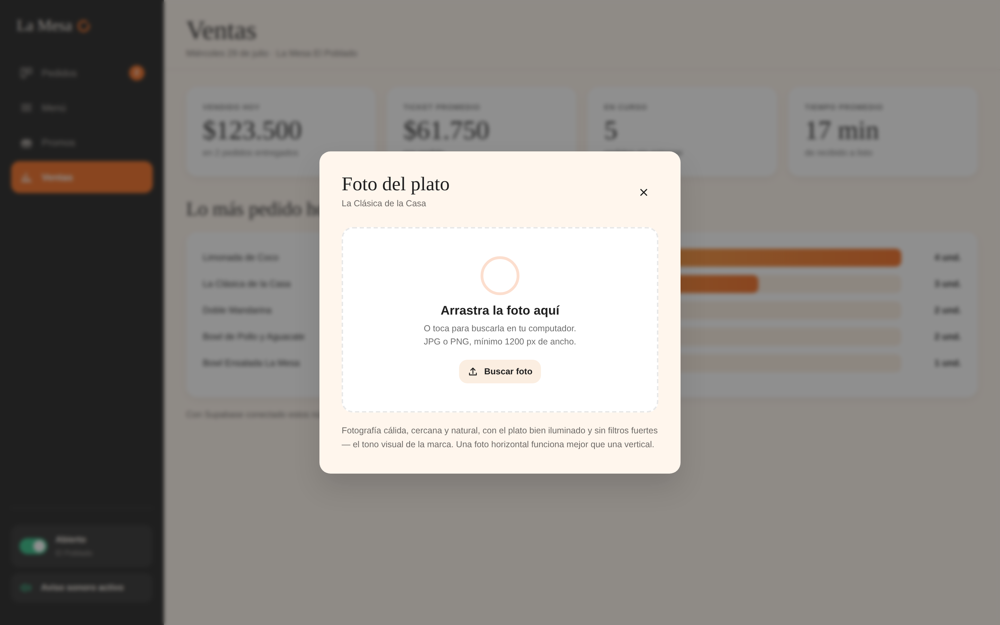

<div align="center">

# La Mesa

**Sistema completo de pedidos para un restaurante: app móvil, panel de cocina y backend.**

*Donde todo se comparte*



[**Ver la app**](https://Daniel-debug-java.github.io/la-mesa/prototipo/la-mesa-app.html) · [**Ver el panel de cocina**](https://Daniel-debug-java.github.io/la-mesa/panel/panel-admin.html) · [Cómo se construyó](docs/BRIEF.md)

</div>

---

## Qué es

Un proyecto personal donde diseñé y construí el sistema completo que necesitaría un restaurante para vender por su cuenta, sin ceder el 30% de comisión a una plataforma de delivery: la app del cliente, el tablero que usa la cocina y el backend que los conecta.

La marca —identidad visual, tono, nombre— es ficticia y la creé para el proyecto. El punto no es el restaurante: es mostrar cómo llevo algo desde una imagen de design system hasta un sistema que compila, se verifica solo y se puede desplegar.

**Los dos enlaces de arriba funcionan.** No son videos ni mockups: son la app y el panel corriendo en el navegador con datos de demostración. Se pueden tocar.

## Lo que más me interesa que se mire

**Mesa Compartida.** El lema de la marca es "donde todo se comparte", así que lo convertí en función en vez de dejarlo en el eslogan: abres una mesa, compartes un código de seis dígitos, y cada quien agrega sus platos al mismo pedido desde su teléfono. Al cerrar, cada uno paga lo suyo o alguien invita. Ninguna app grande de la categoría en Colombia lo tiene resuelto.

**El anillo.** El isotipo de la marca es un anillo abierto —una mesa vista desde arriba— y lo usé como dispositivo estructural en toda la app: rodea a quienes comparten mesa, se llena a medida que avanza el pedido, marca el progreso hacia el siguiente nivel de fidelidad. Es el único gesto decorativo que me permití; todo lo demás se mantiene sobrio.

**La seguridad del pago.** El monto a cobrar nunca sale del teléfono. La app manda solo el id del pedido y el servidor recalcula el total desde la base antes de firmar. En el otro sentido, la app nunca decide que un pago salió bien: eso lo confirma la pasarela contra un webhook cuyo checksum se valida. Detalles en [`supabase/functions/README.md`](supabase/functions/README.md).

## Cómo está armado

| Pieza | Qué es | Stack |
|---|---|---|
| [`app-movil/`](app-movil/) | App del cliente, iOS y Android | Expo · React Native · TypeScript · Zustand |
| [`panel/`](panel/) | Tablero de cocina y gestión de menú | HTML, CSS y JS sin dependencias |
| [`supabase/`](supabase/) | Esquema, datos semilla y funciones de servidor | PostgreSQL · Deno Edge Functions |
| [`prototipo/`](prototipo/) | Prototipo navegable, previo al código real | HTML de un solo archivo |
| [`docs/`](docs/) | Brief del proyecto, capturas, verificador de contraste | — |

<table>
<tr>
<td width="50%"></td>
<td width="50%"></td>
</tr>
<tr>
<td><b>Tablero de cocina.</b> Cuatro columnas, cambio de estado en un toque y un reloj por pedido que pasa de gris a ámbar a rojo según se demora. Aviso sonoro generado en el navegador, sin archivos externos.</td>
<td><b>Editor de foto.</b> El encuadre se decide una vez y alimenta las tres formas donde la app usa la imagen, con vista previa de cada una. Nadie sube una foto bonita que queda decapitada en el carrito.</td>
</tr>
</table>

## Decisiones que tomé y por qué

**Supabase en vez de un backend propio.** Necesitaba tiempo real para que el cambio de estado en cocina llegue al teléfono del cliente, seguridad por fila para que nadie vea pedidos ajenos, y almacenamiento para las fotos. Escribir eso a mano habría sido semanas de trabajo que no demuestran nada nuevo.

**El panel sin framework.** Es una herramienta interna que corre en una tablet en una cocina. React ahí serían 200 KB y un paso de compilación a cambio de nada. Un archivo HTML que se abre y funciona es la respuesta correcta, y sostener esa decisión también es criterio.

**Modelo híbrido de domicilio.** La app controla el pedido, el pago y la relación con el cliente; el transporte se contrata por viaje a una mensajería. Sin flota propia y sin ceder el dato del cliente a una plataforma.

**Multi-sede desde el primer día.** El esquema soporta varias sedes y monedas aunque solo haya una. Es barato hacerlo al principio e imposible después.

**El código está en español.** Nombres de variables, funciones y comentarios. Es un proyecto de una marca colombiana y el equipo que lo mantendría hablaría español; me pareció más honesto que traducir a medias.

## Lo que verifiqué

La mayoría de proyectos de portafolio no tienen forma de comprobar que funcionan. Este sí, y corre solo en cada push:

```bash
cd app-movil && npx tsc --noEmit          # TypeScript sin errores
cd app-movil && npx expo export --platform android   # el bundle resuelve entero
python3 docs/contraste.py                  # los 14 pares de color pasan WCAG AA
node supabase/functions/_pruebas/firma.prueba.mjs    # firmas y checksums de pago
```

El verificador de contraste nació de un problema real: medí la paleta de la marca y cuatro usos no pasaban el mínimo de legibilidad. El naranja mandarina como precio de 13px daba 2,85 sobre 4,5 requerido. La solución no fue cambiar la marca sino separar los usos —la paleta original para superficies y acciones, variantes más profundas del mismo tono para texto— y dejar el verificador para que no se degrade sin que nadie se entere.

Las pruebas de firma comprueban contra el ejemplo publicado por Wompi que mi hash coincide con el suyo, y que un checksum alterado, un monto manipulado o un secreto equivocado se rechacen.

## Correrlo

**La app:**

```bash
cd app-movil
npm install
npm start        # escanea el QR con Expo Go
```

Arranca en modo demostración con el menú completo, carrito, cupones y puntos. Para conectarla a un backend real: copiar `.env.example` a `.env`, correr `supabase/schema.sql` y `supabase/seed.sql`, y pegar las credenciales. La app detecta sola que hay backend.

**El panel y el prototipo:** abrir el `.html` en el navegador. No hay nada que instalar.

## Lo que no está hecho

Prefiero decirlo a que se note. La asignación de mensajero es manual desde el panel, no por API. Las direcciones guardadas del cliente están fijas en el checkout. Los platos no tienen fotos reales —hay marcadores de posición diseñados a propósito, pero una app de comida se vende con comida— y eso es una sesión de fotos, no código. Y la pestaña Momentos hoy se ve bien pero no se puede hacer nada en ella; era la siguiente en mi lista.

Canela, la tipografía de títulos del design system, es comercial y requiere licencia. El código la pide primero y cae a una sustituta parecida si no está, así que el proyecto corre sin comprar nada y adopta la real copiando dos archivos.

---

<details>
<summary><b>In English</b></summary>

**La Mesa** is a complete ordering system for a restaurant: a React Native customer app, a real-time kitchen dashboard, and a PostgreSQL backend with signed payment flows.

Built as a personal project. The brand is fictional and I designed it for this — the point is showing how I take something from a design system image to a system that compiles, verifies itself, and can be deployed.

Both demo links at the top are live and interactive, running on demo data. Highlights: a shared-table feature where several people build one order from their own phones; server-side payment signing where the amount is never trusted from the client; and an automated WCAG contrast checker that came out of finding four real accessibility failures in the brand palette.

Code and comments are in Spanish — it's a Colombian brand and the team maintaining it would speak Spanish.

</details>

<div align="center">
<sub>Proyecto personal · marca ficticia · <a href="LICENSE">MIT</a></sub>
</div>
